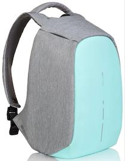

# RTK/GopherConRu-2019 Fulltext search cup

[](https://travis-ci.org/Restream/gophercon2019_ft_cup)

## Конкурсная задача

Вне зависимости от размера и количества контента любой сервис, показывающий фильмы, сериалы, TV-трансляции, сталкивается с необходимостью дать пользователям полнотекстовый поиск по контенту. Чем качественнее и быстрее поиск отвечает на запросы — тем чаще и больше будут пользоваться сервисом.

Такой поиск реализован в Ростелекоме на платформе цифрового телевидения Wink. Бэкенд поиска реализован на Go и БД Reindexer, ежедневно обслуживает миллионы пользователей.

Мы предлагаем всем участникам GopherConRu реализовать приложение поиска контента. Усовершенствовать поиск: сделать его ещё лучше, ещё быстрее и удобнее. Приложение должно как можно быстрее выдавать результаты поиска по базе с контентом (фильмы/программа телепередач) на запросы от фронтенда - по сути предоставлять для фронтенда функциональное API

## Правила участия в конкурсе

Для того чтобы начать, скачай [архив](https://www.dropbox.com/s/npd5k0lpvo22k7m/data.tar.gz?dl=1) с тестовыми данными в формате JSON. Тебе необходимо сначала создать, а затем и развернуть производительный сервер приложения, который будет реализовывать необходимое API поиска и фильтрации к этому контенту.

Можно использовать любые веб-технологии, которые сможешь найти или придумать.

## Призовой фонд
Для победителей мы приготовили призовой фонд:

*1 место:* комплект умного дома «управление» с контроллером, датчиками движения, температуры и освещенности, умной лампочкой и умной розеткой. Сервиса «Умный дом» в подарок.


*2 место:* камера видеонаблюдения для умного дома, модель Ezviz C6T. Полгода сервиса «Видеонаблюдение» в подарок.


*3 место:* рюкзак Bobby с кружкой и толстовкой



## Как участвовать

0. Для участия заполни [форму](https://forms.gle/uoMBGfuGiwkKPztE7), так же потребуются аккаунты на http://github.com и https://hub.docker.com .
Впрочем, мы надеемся, что они у тебя уже есть.

1. Подготовь Docker образ с решением конкурсной задачи. В нем должен быть запущен сервер приложения, принимающий запросы на порту 8080. Пример Dockerfile для сборки контейнера можно посмотреть [тут](Dockerfile)

2. Загрузи подготовленный образ на dockerhub.
```
docker push <yourname>/rtk_ft_solution:<tag>
```

3. Создай форк репозитория https://github.com/restream/gophercon2019_ft_cup

4. Отредактируй файл .travis.yml - в переменной окружения `TEST_IMAGE` укажи имя образа с твоим решением, опубликованного на dockerhub

```yml
env:
  global:
    - TEST_IMAGE=<yourname>/rtk_ft_solution:<tag>
```

5. Создай Merge Request https://github.com/Restream/gophercon2019_ft_cup
После создания MR будет автоматически запущен тестовый пайплайн обстрела в сервисе travis-ci, и через несколько минут будет получен результат тестирования.

6. Как будет тестироваться решение

После запуска докер контейнера у приложения будет некоторое время на подготовку к обстрелу. Время подготовки - 2 минуты. За это время приложение должно успеть загрузить данные в БД и в движок полнотекстового поиска.

Решения тестируются в докер контейнере запущенном в окружении [travis-ci](https://docs.travis-ci.com/user/reference/overview/).
Ограничения окружения: по RAM - 7GB, по дисковому пространству ~ 18GB диск

Тестовые данные будут смонтированы в папку /data контейнера.

- файл `epg.json` - программа телепередач
- файл `media_items.json` - список медиа-контента

Объем и содержание тестовых данных может меняться в процессе проведения конкурса, но они будут одинаковыми для всех участников.

## Критерии оценки

При тестировании(обстреле) решения учитывается как скорость выдачи ответов сервером приложений, так и их корректность.
У приложения будут вызываться описанные ниже методы, со случайным набором параметров. Последовательность вызовов и набор параметров так же может меняться в процессе проведения конкурса.

При выборе победителей кроме технических характеристик будут оцениваться исходные тексты решения - мы предполагаем, что решение будет "честно" реализовывать требуемый функционал, не пытаясь подстроиться под конкретный датасет, подгоняя ответы под ожидания системы проверки :)

Если остались вопросы - В любое время ты сможешь подойти на стенд Ростелеком-а и проконсультироваться с экспертами по задаче или написать в чатик конкурса https://t.me/rtkgophercon2019

## Описание предметной области

### Фильмы

| Поле                                         | Тип      | Описание                                                                                |
|----------------------------------------------|----------|-----------------------------------------------------------------------------------------|
| `id`                                         | int64    | идентификатор контента                                                                  |
| `name`                                       | string   | название контента                                                                       |
| `type`                                       | string   | тип контента: фильм ("film"), сериал ("series"), сезон ("season") или серия ("episode") |
| `duration`                                   | int      | продолжительность контента в секундах                                                   |
| `countries`                                  | []string | страны-производители контента                                                           |
| `age_value`                                  | int      | нижняя граница возраста (например, 18)                                                  |
| `year`                                       | string   | год или годы выхода (примеры: "2016", "1996-2005")                                      |
| `logo`                                       | string   | url картинки с обложкой контента                                                        |
| `rating`                                     | float    | средний рейтинг по всем источникам                                                      |
| `description`                                | string   | краткое описание контента                                                               |
| `genres`                                     | []string | жанры контента                                                                          |
| `persons`                                    | object   | участники съёмочной группы                                                              |
| `person.name`                                | string   | имя                                                                                     |
| `person.type`                                | string   | тип: актёр ("actor"), режиссёр ("director")                                             |
| `packages`                                   | []int64  | идентификаторы пакетов, в которые входит контент                                         |
| `asset_types`                                | []int64  | содержит идентификаторы типов ассетов

Пример:

````json
{
  "id": 74170248,
  "name": "Апгрейд",
  "type": "film",
  "duration": 5807,
  "countries": ["Австралия"],
  "age_value":  18 ,
  "year": "2018",
  "logo": "/sdp/nc-poster1545652540696.jpg",
  "rating":  7.7,
  "description": "В результате автокатастрофы автомеханик Грей теряет жену и становится инвалидом. Владелец крупной корпорации Эрон Кин предлагает ему поучаствовать в эксперименте. Грею вживляют новейший чип – с его помощью герой вновь встаёт на ноги и получает нечеловеческую силу. Какими будут побочки?",
  "genres": [ "Фантастика", "Боевики", "Триллеры", "Детективы", "Криминал" ],
  "persons": [
    { "name": "Ли Уоннелл", "type": "director" },
    { "name": "Логан Маршалл-Грин", "type": "actor" },
    { "name": "Мелани Валльехо", "type": "actor" },
    { "name": "Стив Даниелсен", "type": "actor" },
    { "name": "Эбби Краден", "type": "actor" },
    { "name": "Харрисон Гилбертсон", "type": "actor" }
  ],
  "packages": [ 1000, 1004, 1200, 21713930 ],
  "asset_types": [ 1000059, 2377438 ]
}
````

### Программа телепередач

| Поле           | Тип    | Описание                               |
|----------------|--------|----------------------------------------|
| `id`           | int64  | идентификатор контента                 |
| `name`         | string | название контента                      |
| `start_time`   | int    | время начала передачи (timestamp)      |
| `end_time`     | int    | время окончания передачи (timestamp)   |
| `age_value`    | int    | нижняя граница возраста (например, 18) |
| `logo`         | string | url картинки с обложкой контента       |
| `description`  | string | краткое описание контента              |
| `genre`        | string | жанр                                   |
| `channel`      | object | канал                                  |
| `channel.name` | string | название канала                        |
| `channel.logo` | string | url картинки с обложкой канала         |
| `channel.id`   | int64  | идентификатор канала                   |

```JSON
{
  "id": 214941696,
  "name": "Новости",
  "age_value": 0,
  "start_time": 1554793200,
  "end_time": 1554794100,
  "genre": "Расследование",
  "description": "Ежедневная информационная программа, сообщающая о наиболее важных событиях в стране и мире. \"Первый канал\" оперативно и достоверно рассказывает зрителям о том, что произошло в области политики, экономики, общественной жизни, культуры, спорта. Знакомит с самой свежей информацией, поступившей от собственных корреспондентов и по каналам информагентств.",
  "logo": "/sdp/vlg/imp_stv268287171.jpg",
  "channel": {
    "id": 1000069,
    "name": "Первый канал",
    "logo": "/sdp/vlg/nclogo1529398449250.png"
  },
  "location_id": 300005
}

```

## Методы

### Полнотекстовый поиск контента

Метод выполняет полнотекстовый поиск по всей базе контента, при поиске фильмов должны учитываться следующие поля, в порядке убывания значимости(релевантности): `name`, `countries`,  `persons.name`, `genres`, `year`, `description`

При поиске программ телепередач должны учитываться поля `name`, `genre` ,`channel.name`, `description`

Полнотекстовый поиск должен находить нечеткие совпадения поискового запроса, с контентом в базе. Ожидается поддержка функциональности:
- ввод поискового запроса 'транслитом'.
- ввод поискового запроса в неверной раскладке клавиатуры. Например, по запросу `keynbr` должен находится контент содержащий `лунтик`
- поиск с учетом возможных словоформ. Например, по запросу `кухни`, должен находится контент содержащий `кухня`
- поиск с учетом возможных опечаток. Допускается одна опечатка в слова. Например, по запросу `Первфй` должен находится контент содержащий слово `Первый`
- если длина слова в запросе более 2-ух символов, поиск по началу слов в контенте, если длина слова более 3-ех символов, то поиск по любому вхождению слова.

Должен находиться контент, в котором встречается хотя бы одно слово из поискового запроса. Чем больше слов из поискового запроса нашлось в документе, тем выше должна быть его релевантность.

Найденный контент должен быть отсортирован в порядке уменьшения релевантности.

````
GET /api/v1/search
````

#### Допустимые параметры запроса

| Аргумент        | Тип      | Описание                                                                                   |
|-----------------|----------|--------------------------------------------------------------------------------------------|
| `limit`         | int      | Максимальное количество элементов в ответе                                                 |
| `offset`        | int      | Смещение. Будут пропущены все элементы до указанного порядкового номера                    |
| `query`         | string   | Поисковый запрос                                                                           |

#### формат ответа

````json
{
   "total_items" : 100,
   "items" : [
      {
          "type" : "media_item",
          "media_item" : {
            // Все поля сущности media_item ....
          }
      },
      {
          "type" : "epg",
          "epg" : {
            // Все поля сущности epg ....
        }
      }
   ]
}
````

### Список фильмов

```
GET /api/v1/media_items
```

Допустимые параметры запроса:

| Аргумент    | Тип      | Описание                                                                                   |
|-------------|----------|--------------------------------------------------------------------------------------------|
| `limit`     | int      | Максимальное количество элементов в ответе                                                 |
| `offset`    | int      | Смещение. Будут пропущены все элементы до указанного порядкового номера                    |
| `genres`    | []string | Идентификаторы жанров                                                                      |
| `year_ge`   | int      | Вернуть контент, вышедший не ранее указанного года                                         |
| `year_le`   | int      | Вернуть контент, вышедший не позднее указанного года                                       |
| `countries` | []string | Страны                                                                                     |
| `sort_by`   | string   | Сортировка объектов по алфавиту ("name"), рейтингу ("rating"), году ("year")               |
| `sort_dir`  | string   | Направление сортировки: от меньшего к большему ("asc") или от большего к меньшему ("desc") |

#### формат ответа

```JSON
{
    "total_items" : 100,
    "items" : [
        {
            "id" : 293823,
            "name" : "Терминатор"
             // Остальные поля сущности media_item ....
        }
    ]
}
```

### Телепередачи

```
GET /api/v1/epg?
```

Допустимые параметры запроса:

| Аргумент      | Тип      | Описание                                                                                   |
|---------------|----------|--------------------------------------------------------------------------------------------|
| `start_time`  | int      | начало временного окна (timestamp)                                                         |
| `end_time`    | int      | конец временного окна (timestamp)                                                          |
| `channel_ids` | []int    | идентификаторы каналов (через запятую, без пробелов)                                       |
| `limit`       | int      | ограничение количества передач в ответе                                                    |

#### формат ответа

```JSON
{
    "total_items" : 100,
    "items" : [
        {
            "id" : 293823,
            "name" : "Новости"
             // Остальные поля сущности epg ....
        }
    ]
}
````

## Награждение
Задача сложная, но тем интереснее участие. Скорее всего, тебе потребуется больше времени, чем у тебя на конференции на реализацию полнотекстового поиска. Мы это понимаем. Поэтому публикуем информацию о конкурсе заранее, чтобы у тебя было время изучить правила участия и подготовиться.

Награждение победителей состоится на GopherConRu в 18:00 на стенде Ростелекома.
